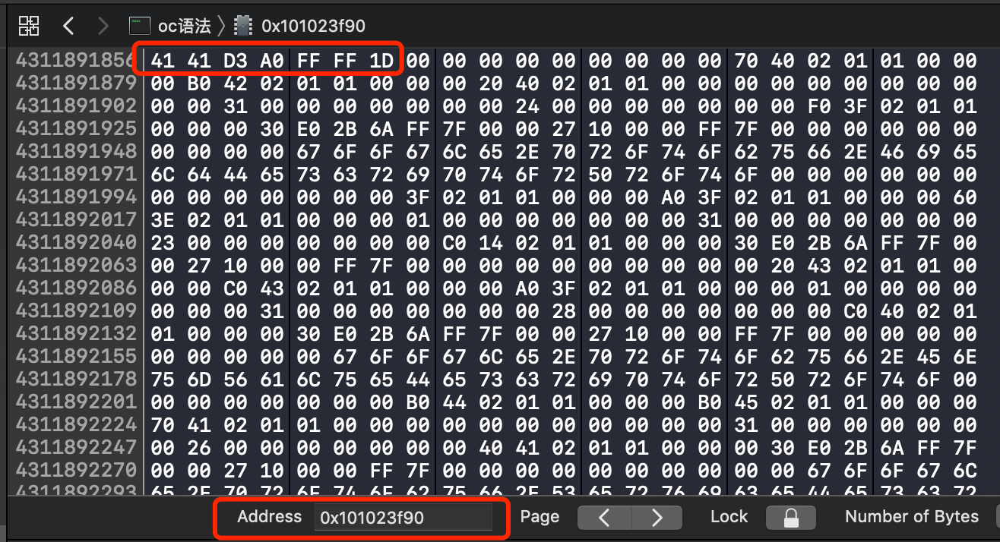

## 源代码下载及操作命令
1. 生成索引目录：https://github.com/ekalinin/github-markdown-toc  下载下来，打开gh-md-toc所有的目录，输入./gh-md-toc /Users/yongsheng/VSMVVM/README.md即可
2. 源代码下载: https://opensource.apple.com/tarballs/objc4/   
  - objc4 的源码不能直接编译，需要配置相关环境才能运行。可以在github下载可调式的源码:https://github.com/RetVal/objc-runtime   
  - objc 运行时源码的入口在 void _objc_init(void) 函数

### 命令
1. 将Objective-C代码转换为C\C++代码
```Objective-C
xcrun -sdk iphoneos clang -arch arm64 -rewrite-objc OC源文件 -o 输出的CPP文件
// 如：xcrun -sdk iphoneos clang -arch arm64 -rewrite-objc main.m -o main-arm64.cpp
```
- 模拟器：i386
- 32bit: armv7
- 64bit: arm64


## 索引
   * [Objecttive-C的本质是什么？](#Objecttive-C的本质是什么？)
   * [一个NSObject对象占用多少内存？](#一个nsobject对象占用多少内存)
   * [对象的isa指针指向哪里？](#对象的isa指针指向哪里)


## 问题

```Objective-C

```

### Objecttive-C的本质是什么？
Objective-C 底层实现实际都是C\C++代码   
Objective-C ---> C\C++ ---> 汇编语言 ---> 机器语言

思考：Objective-C的对象、类主要是基于C\C++的什么数据结构实现的？  
答：结构体

分析NSObject对象
1. Objective代码编写如下：
```Objective-C
int main(int argc, const char * argv[]) {
    @autoreleasepool {
        NSObject *obj = [[NSObject alloc] init];
    }
     return 0;
}
``` 
2. 执行命令，得到转为C++的文件main-arm64.cpp , 搜索NSObject_IMPL
```Objective-C
struct NSObject_IMPL {
	Class isa;
};
```

3. 实际中的 NSObject 类的声明是
```Objective-C
@interface NSObject <NSObject> {
#pragma clang diagnostic push
#pragma clang diagnostic ignored "-Wobjc-interface-ivars"
    Class isa  OBJC_ISA_AVAILABILITY;
#pragma clang diagnostic pop
}
```
简化就是：
```Objective-C
@interface NSObject <NSObject> {
    Class isa ;
}
```

4. 对比第2步生成的C++代码，和第3步OC声明的方法，可以看出，NSObject 实际是转为结构体 NSObject_IMPL  
结论：Objective-C的对象、类主要是基于C\C++的【结构体】数据结构实现的


### 一个NSObject对象占用多少内存？
objc4代码路径：objc-runtime-new.m --> class_getInstanceSize

```Objective-C
size_t class_getInstanceSize(Class cls)
{
    if (!cls) return 0;
    return cls->alignedInstanceSize();
}
```

系统分配了16个字节给NSObject对象（通过malloc_size函数获得）  
但NSObject对象内部只使用了8个字节的空间（64bit环境下，可以通过class_getInstanceSize函数获得）  
在源代码中有对齐逻辑，如果字节小于8，会自动补齐到

**可以通过内存地址查看占用字节**
1. 断点，点击！号，查看实例对象的内存地址  

2. 复制内存地址  

3. 将内存地址，打开 Xcode --> Debug --> Debug Workflow --> View Memory，粘贴到Address中，回车   



# Author
jiangys, jys509@126.com

# License
iOSInterviewQuestions is available under the MIT license. See the LICENSE file for more info.
